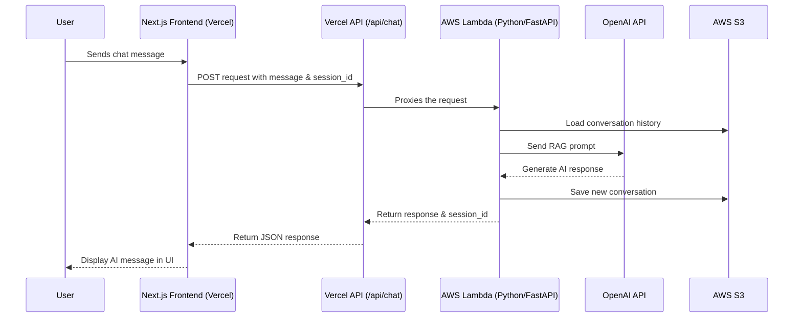

<table width="100%">
  <tr>
    <td align="center">
      <h1 style="margin: 0;">Rıdvan Yiğit - AI Engineer Portfolio</h1>
      <p style="margin: 0;">A modern, serverless-powered portfolio showcasing projects in Agentic AI, RAG, and cloud deployments.</p>
    </td>
  </tr>
</table>

<p align="center">
  <a href="#-key-features"><strong>Features</strong></a> ·
  <a href="#-tech-stack"><strong>Tech Stack</strong></strong></a> ·
  <a href="#-architecture-overview"><strong>Architecture</strong></a> ·
  <a href="#-getting-started"><strong>Setup</strong></a>
</p>

<p align="center">
  
  
  
  
  
</p>

This repository contains the source code for my personal portfolio website, **[ridvanyigit.com](https://www.ridvanyigit.com)**. It's built with Next.js and features a fully integrated, RAG-powered AI chatbot with a serverless AWS backend.

<br>

---

### 🚀 Key Features

- **Modern Frontend**: Built with Next.js 15 App Router, React 19, and styled with Tailwind CSS & shadcn/ui.
- **Interactive AI Chatbot**: A floating chatbot that connects to a serverless backend, providing information about my skills and projects.
- **Persistent Memory**: The chatbot remembers conversation history for each user via a session-based memory system on AWS S3.
- **Serverless API Endpoints**: Uses Next.js API Routes on Vercel to proxy requests and handle integrations securely.
- **Contact Form Integration**: A contact form that saves submissions to Google Sheets and sends real-time push notifications via Pushover.
- **Fully Responsive & Themed**: Features a fluid design that works on all devices, complete with a dark/light mode toggle.
- **Smooth Animations**: Engaging user experience with animations powered by Framer Motion.

---

### 🛠️ Tech Stack

The project is architected with a decoupled frontend and backend, leveraging best-in-class technologies for scalability and performance.

| Frontend (Vercel)                               | Backend & Integrations (AWS)                        |
| ----------------------------------------------- | --------------------------------------------------- |
| **Framework**: Next.js 15                       | **Chatbot Runtime**: AWS Lambda (Python 3.12)       |
| **Library**: React 19                           | **API Framework**: FastAPI                          |
| **Language**: TypeScript                        | **AI Model**: OpenAI GPT-4o-mini                    |
| **Styling**: Tailwind CSS 4, shadcn/ui          | **Data Storage**: AWS S3 (for chat memory)          |
| **Animations**: Framer Motion                   | **Notifications**: Pushover API                     |
| **Deployment**: Vercel                          | **Data Logging**: Google Sheets API                 |

---

### 🏗️ Architecture Overview

This project utilizes a hybrid architecture, combining a Vercel-hosted frontend with a Python-based serverless backend on AWS.

1.  **User Interaction**: The user visits [ridvanyigit.com](https://www.ridvanyigit.com) and interacts with the React components rendered by Next.js.
2.  **Chat Request**: When a user sends a message in the chatbot, the Next.js frontend sends a `POST` request to its own backend at `/api/chat`.
3.  **Vercel API Proxy**: The `/api/chat` endpoint on Vercel acts as a secure proxy. It receives the request and forwards it to the AWS Lambda function URL. This hides the backend endpoint and credentials from the public.
4.  **AWS Lambda Execution**: The Python FastAPI app on AWS Lambda receives the request.
    -   It loads the conversation history from the S3 bucket using the `session_id`.
    -   It constructs a detailed RAG prompt containing my personal info, skills, and conversation history.
    -   It queries the OpenAI API (`gpt-4o-mini`) to generate a response.
    -   It saves the new conversation turn back to the S3 bucket.
5.  **Response Flow**: The response travels back from AWS -> Vercel -> Next.js Frontend, where it is displayed to the user.



---

### 🏁 Getting Started

Follow these steps to set up and run the project locally.

#### Prerequisites

- Node.js (v18 or later)
- `npm` or `yarn`

#### 1. Clone the Repository

```bash
git clone https://github.com/ridvanyigit/ai-portfolio.git
cd ai-portfolio```

#### 2. Install Dependencies

```bash
npm install
```

#### 3. Set Up Environment Variables

Create a new file named `.env.local` in the root of the project by copying the example file.

```bash
cp .env.example .env.local
```

Now, open `.env.local` and fill in the required values:

```env
# URL for the local development server
NEXT_PUBLIC_BASE_URL=http://localhost:3000

# Pushover API credentials for the contact form notifications
PUSHOVER_API_TOKEN=your_pushover_app_token_here
PUSHOVER_USER_KEY=your_pushover_user_key_here
```

#### 4. Run the Development Server

```bash
npm run dev
```

The application will be available at `http://localhost:3000`.

### 📜 Available Scripts

-   `npm run dev`: Starts the development server.
-   `npm run build`: Builds the application for production.
-   `npm run start`: Starts the production server.
-   `npm run lint`: Runs the ESLint linter.

---

*Feel free to fork this repository or reach out if you have any questions!*